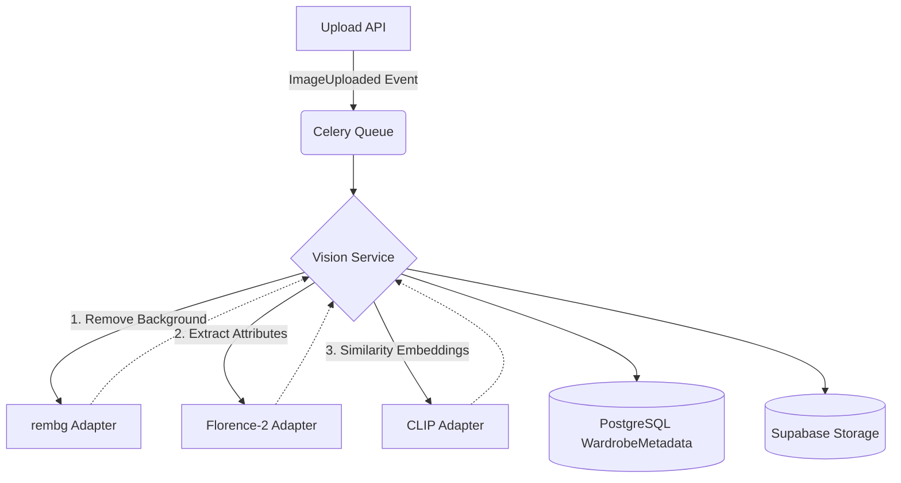

# Module: AI Gateway & Vision Intelligence

This module is responsible for the asynchronous processing of clothing images. It coordinates background removal, attribute extraction (color, category, pattern), and embedding generation for similarity search.

## Architecture

The system uses a strictly event-driven **Adapter Pattern** to ensure models can be swapped out effortlessly in the future (e.g., swapping Florence-2 for Gemini Vision).

## The AI Gateway
The `AIGateway` (`app/ai/gateway.py`) is a protective proxy around the heavy VLM models. It automatically catches inference crashes (like CUDA Out Of Memory) and uses an exponential backoff retry policy (via `tenacity`) to gracefully recover.

## The Model Registry
Because loading models like `microsoft/Florence-2-base` into GPU memory is extremely slow, the `ModelRegistry` (`app/ai/registry.py`) acts as a singleton cache. It lazy-loads models only when required and provides an interface to unload models if memory needs to be freed.

## Using pgvector
The generated 512-dimensional CLIP embedding is saved directly to PostgreSQL using the `pgvector` extension. This allows the backend to perform extremely fast, native cosine similarity searches (e.g., finding all items in a wardrobe that look similar to a given image) without needing a dedicated vector database like Pinecone.
